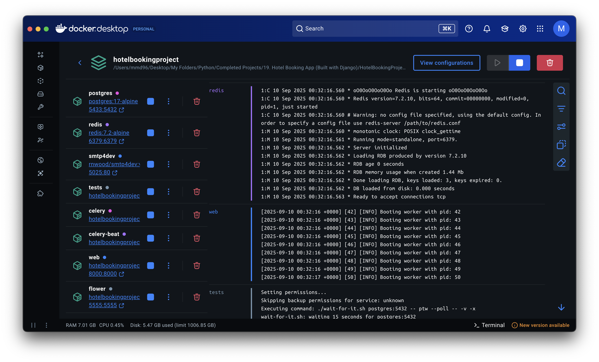

# Scalable Hotel Booking Platform 🏨

A professional, full-featured hotel booking system built with **Django**, designed to serve both guests and staff across multiple hotel branches. The application supports full-stack web functionality as well as a standalone REST API backend, and is production-ready. Key features include VIP services, advanced booking management, robust email notifications, background task processing with Celery and periodic cleanup jobs with Celery beat, and daily database backups to a dedicated AWS' S3 bucket.

---

### 🏠 Home Page


---

## 🚀 Key Features

### 🏦 Guest Functionality

- **Branch Selection & Room Booking**: Guests can browse available hotel branches and rooms, then proceed to reserve based on availability.
- **Reservation Management**: All guests (VIP or regular) can:
  - View their active bookings
  - Modify check-in/check-out dates
  - Cancel or rebook reservations
- **VIP Program**:
  - Sign up as VIP guests
  - Receive exclusive promotions and offers
- **Automated Emails**:
  - Welcome emails upon registration
  - Booking confirmation and change notifications
  - Password reset instructions

### 💡 Staff Interface

- **Centralized Staff Dashboard**:
  - Search, filter, and view all bookings across hotel branches
  - Manage guest bookings with update/delete capabilities
- **Secure Access Control**:
  - Role-based access with support for guest, staff, and admin accounts
  - Custom authentication via email or phone number

### 🔄 Asynchronous Background Tasks

- **Task Queue with Celery + Redis**:
  - Scheduled cleanup of expired or unused bookings
  - Email reminders for upcoming check-ins
  - Automatic retries and fault tolerance
- **Django Signals**:
  - Trigger email notifications on user registration, booking actions, and cancellations
  - Event logging for system activity

### 🛠️ API-Only Version

- A dedicated backend-only implementation using Django REST Framework
- Fully decoupled API for frontend integration or mobile apps
- JWT authentication via **Djoser** and SimpleJWT

---

## 🛠️ Technology Stack

| Layer           | Stack                                   |
| --------------- | --------------------------------------- |
| Backend         | Python, Django, Django REST Framework   |
| Frontend        | Django Templates, Bootstrap             |
| Auth            | JWT, Djoser, Custom User Model          |
| Email           | Brevo / SMTP / SMTP4Dev                 |
| Background Jobs | Celery, Redis                           |
| Database        | Postgres                                |
| Deployment      | Docker, Docker Compose, Gunicorn, Nginx |
| Production      | AWS EC2, HTTPS via SSL (Certbot)        |

---

## 📁 Project Structure

```
HotelBookingProject/
├── accounts/                # Custom user model and auth logic
├── APIs/                    # DRF-based API implementation
├── bookings/                # Booking models, views, signals
├── media/                   # Uploaded user documents and images
├── static/                  # Static files (JS, CSS, Images)
├── seed/                    # Seed data and demo generators
├── nginx/                   # Nginx configs for production
├── Dockerfile               # Docker build file
├── docker-compose.yml       # Dev environment config
├── docker-compose.prod.yml  # Production deployment config
├── manage.py                # Django entry point
```

---

### 🐳 Docker Running Containers



---


## 🌐 Deployment

### ✅ Production

- Full container orchestration via **Docker Compose**
- HTTPS-secured **Nginx + Gunicorn** stack
- Static/media collection and DB seeding handled on container start
- Production environment hosted on **AWS EC2**
- Daily database backup to **AWS S3**.
- SSL certificates via Certbot (Let's Encrypt)

### ⚙️ Development

- Local development with hot-reload and volume binding
- SMTP4Dev for local email previews
- Includes **Django Debug Toolbar** and **Silk Profiler**

Start locally with:

```bash
git clone https://github.com/Mo-Khalifa96/HotelBookingProject.git
cd HotelBookingProject
docker compose --profile dev up --build
```

Or use the deploy script:

```bash
git clone https://github.com/Mo-Khalifa96/HotelBookingProject.git
cd HotelBookingProject
chmod +x deploy.dev.sh
./deploy.dev.sh
```

Access interfaces:

- Web: [http://localhost:8000](http://localhost:8000)
- Email Preview (SMTP4Dev): [http://localhost:5025](http://localhost:5025)
- Task Monitoring (Flower): [http://localhost:5555](http://localhost:5555)

---

## 📱 API Endpoints

A RESTful API is available under the `/api/` namespace, supporting:

- Guest and Staff registration
- Booking creation, modification, and deletion
- Bookings/branches/rooms listings
- Authentication and password management (via JWT/Djoser)

---


---

## 🤝 Contributing

Pull requests are welcome. For major changes, please open an issue to discuss improvements or features.

---

## 👨‍💼 Author

**Mohamed Khalifa**\
Data Scientist | Machine Learning Specialist | Backend Developer\
[GitHub](https://github.com/Mo-Khalifa96) | [LinkedIn](https://www.linkedin.com/in/mohamed-khalifa-182015175/)

---

## 📄 License

This project is licensed under the [MIT License](LICENSE).
